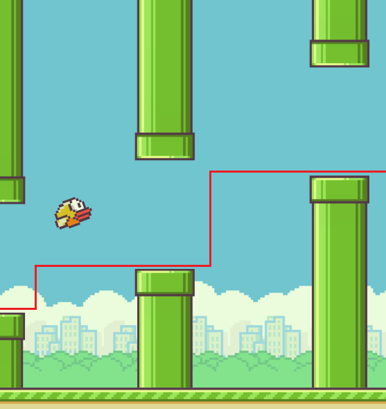
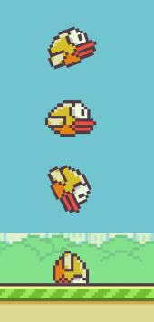
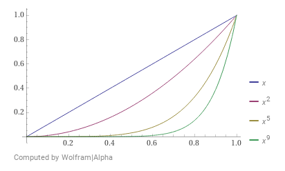
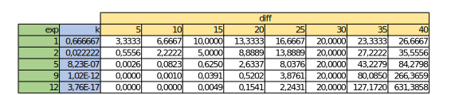
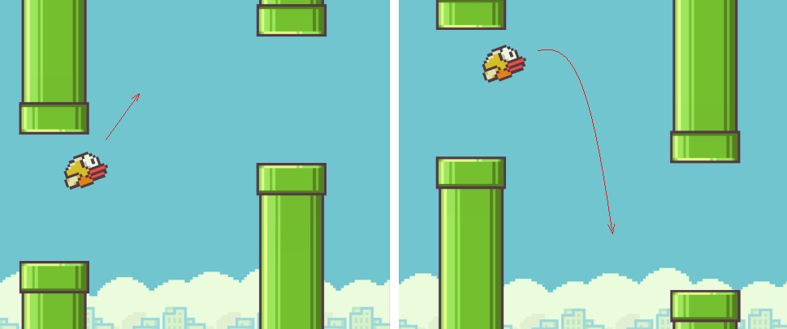
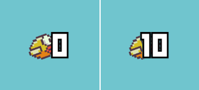

<p align="center">
  
</p>

There are plenty AI-driven flappybird-players out there, so this is an attempt of building one without depending on AI. Some of the logic implemented would also be necessary when building an AI system (image processing for identifying object locations), which corresponds with [Phase 2](#phase-2-scene-detection), but the final result is achieved by analyzing different problems and coming up with a solution for each of them.

This project is build on top of the game [flappybird.io](https://flappybird.io), so what less than to mention its author [Max McDonnell](https://github.com/maxmcd).

## Phase 1: Determine the strategy

To decide on the program strategy, I analized what I do when playing this game: when the bird is falling and is about to hit the lower pipe, I jump. If the bird's position is lower than the next pipe, I jump until the previous statement applies. This makes it a simple strategy:

- We keep track of the position of the bird and the lower pipe. When the bird's position is lower than the latter, we command the program to jump.
- New pipes are spawning at a certain rate. A pipe is relevant until it is further to the left of the bird, at which point we switch on to the next pipe.

<p align="center">
  
</p>

## Phase 2: Scene detection

The scene-processing is the most important and core element of the system. Its responsability is to read the scene and produce accurate data regarding the position of the objects in the scene (bird and pipes).
The bottleneck of this process is the screen-capturing, that is, the process of capturing a part of the screen to later find the objects inside. This is an operation which is repeated for every position update, and will determine its rate.
To optimize this, various packages were tested ([test.py](./test.py)) to determine the fastest one.

After this was sorted out and after some iterations, the complete implementation is as follows:

1. **Capture the full game square**: it appears to be faster than each element capturing its own section of the game.
2. **Identify each element**: each element-processor receives the game-screenshot and is responsible for querying the correct rows/columns.
3. **Notify the updated results**: once all element-processors are finished, an update is dispatched so the main program can consume the new data.

### What to capture

The result of this process must consist on two pieces of information: the position of the bird and the top position of the low pipe.



For the **bird**, we need to identify the best column to look into. The main issue is that when the bird jumps, its body changes orientation, and some of its colors differ from one frame to another. To adress this issue, I analyzed different images of the bird on different orientations to find the best coordinates and color (I decided on ).

For the **pipe**, we can just look to the top-right corner of the game-screenshot and wait to see something different than the sky color (). To address the spawning of new pipes, we will also capture the pipe at the same *x*-position as the bird. This way, when the bird passes the pipe, the current pipe will be removed and the next in the queue will be used.

In the coordinate system used, _y_ goes from top to bottom and _x_ from left to right, so the point _x=0, y=0_ is in the top left corner of the game. This becomes relevant when later describing the logic implemented.

<br clear="both" />
Some tricks that helped improving this process:

- Use offline (airplane mode, or disabling internet connection): this reduced lag produced by ads in the page.

## Phase 3: Basic program control

A simple program control was created to stop the test/execution in a fast way (keep in mind that this program emulates the keyboard to play the game, so a kill switch sounded smart). At the moment, this is controlled with the `esc` key, and is the only concern of this module.

## Phase 4: Game decision-making

This part should be very straight forward: if the position of the bird is lower than the pipe, jump. Despite the apparent simplicity, a variaty of problems arose.

### Problem 1: Consecutive jumps I

When a jump is triggered, the next updated data still shows the bird with a lower position than the pipe, which causes a consecutive jump, and in most scenarios is fatal. To fix this, a `sleep` call was introduced after a jump is perfomed, so when the scene is next read the bird's position is higher than the pipe's. To prevent similar issues, a counter was also used to keep track of the number of updates since the last jump. This way, we can also avoid consecutive jumps by requiring this counter to be above a certain number.

### Problem 2: Big jumps to lower pipes

The bird's height follows the laws of physics: the more time it is free-falling the more speed it will gain. In the context of the game, the greater the velocity the bigger the difference in the bird's *y*-position between consecutive frames. If the bird faces a big jump to a lower pipe, by the time the program identifies that it should jump, its position is already too low to clear the pipe.

**The solution**: use an offset to add to the bird's position. This offset should be proportional to the bird's velocity: as the velocity increases the offset does too. This works like a smoothing function: if the bird needs to travel from *y=100* down to *y=300*, it might jump first on *y=270*, then on *y=290* until it finally reaches *y=300*. The tricky part is finding the correct function to model this behaviour.

To do this, I first gathered same data, like the difference (from now on, `diff`) in the bird's *y*-position between updates (what can be interpreted as velocity). The maximum value came around `30px`. The next step was determining what offset should be applied in this maximum case: this was a trial-error phase. The basic ideas were:

- The greater the `diff` the higher the offset should be.
- For `diff=0`, the offset should be 0 as well ( $f(0)=0$).
- For the max `diff`, the offset should be a certain value, lets say 20px. This means that if the bird's speed is terminal (30px/update), we add 20px to its position (we simulate it is lower than it really is) so it jumps earlier.



I tried different functions using the general form $f(x)=kx^{exp}$, and for each one a constant _k_ was calculated so that $f(30)=20$. The bigger _exp_, the greater the difference for small changes in `diff`. It should also be noted that for negative values of _x_, using an odd exponent will result in a negative value. This is relevant if we also want to apply the smoothing function to negative `diff`s, that is, when the bird is going up.
Initially, I tried odd exponents in order to apply the same function for all values of `diff`, but realized that the smoothing behaviour should be different when the bird is going up than when it is going down: the maximum velocity and respective offsets are different for both cases.
To solve this, I separated the logic: for negative `diff` we apply a certain function, and for positive values another one. This also made easier the tunning of the exponent and the respective constant _k_ for going up and down, as they were independent.
<br clear="both" />

The table below shows the resulting offset for various exponents (for positive values of `diff`). For a given exponent, the value _k_ was used as an starting point, and then tuned based on test runs. After many of these, the exponent for `diff>0` resulted in 12, and for `diff<0`, 3.

<p align="left">

</p>

<br />



Another optimization made in this area was the switching from one pipe onto the next. As it was described in [what-to-capture](#what-to-capture) section, the basic idea is to change to the next available pipe when the bird's *x*-position is greater than the current pipe. But this condition may vary depending on whether the next pipe is higher or lower than the current one: if the next pipe is higher and we switch too soon to the next, the issued jump (because the bird is lower than the now current pipe) may cause the bird to hit the previous pipe. This problem is not that critical when the next pipe is lower: the bird simply does not jump and clears the pipe.
Optimizing this will reduce the risk of "big jumps to lower pipes" by achiving the new required hight earlier on.
The implementation part is simple: when a new pipe is identified, we store in a variable whether it is higher or lower than the previous, and we use this value when capturing the exiting pipe.
<br clear="both" />

### Problem 3: The score



This problem didn't have an effect at the beggining (when the bird's score would not go over 5), but as the program improved and the score increased, some runs would fail inexplicably. I ended up realizing that the score was sometimes covering the column we use to check and find the bird's position.

**The solution**: Contemplate the posibility of not finding the bird during scene-detection. In this case, the previous known data should be used. _The score sits quite high in the game-canvas, so loosing some bird-position updates should not be that critical._

### Problem 4: Consecutive jumps II

After solving [Problem 3](#problem-3-the-score), a strange behaviour started to take place: when the score covered up the bird, the program would no longer crash but it would sometimes jump twice in a row, causing the bird to hit the top pipe. After some analysis, I realized that the fix for Problem 3 was responsible.
Imagine that the bird has a y-position that triggers the jump. Maybe in the following screen-capture the bird is hidden behind the score, so we assume its position is the same as in the previous update, thus **triggering again the jump**.

**The solution**: because we already calculate the difference (`diff`) in the bird's y-position between updates, we can ignore the problem by only jumping if `diff != 0`.

## Installation and setup

> **Note**
> Current implementation relies heavely on windows OS, because the capture of element positions uses libraries optimized for this

<details><summary>Development System Specs</summary>

- OS: Windows 11
- CPU: x64 Intel(R) Core(TM) i7-10700 CPU @ 2.90GHz
- GPU: NVIDIA GeForce GTX 1650
- RAM: 32GB
</details>

<br />

This project was developed with Python 3.9.13 (dxcam package requires >=3.7). To install the required packages:

```sh
python3 -m pip install -r requirements.txt
```

Once everything is installed and set up, open the game in the browser: https://flappybird.io. Then, open a terminal on the directory of the project and execute the main program:

```sh
python3 main.py
```

The program will:

- Gain focus on the browser where the game is opened
- Calculate the correct coordinates of the game (this varies depending on screen size)
- Start the game
